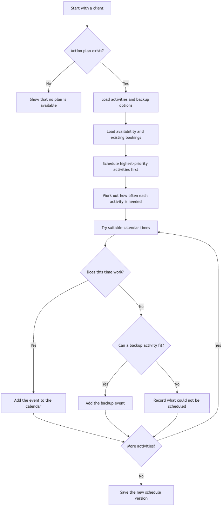
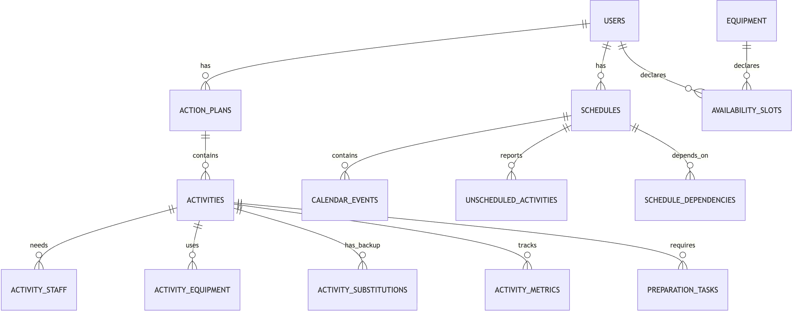

# Elyx Resource Allocator

The Resource Allocator turns Elyx healthspan action plans into practical calendar schedules. It coordinates each member's availability with that of specialists, allied health practitioners, and equipment.

## Key Design Choices

### Explicit availability

Each client/staff/equipment has their own availability slots (weekly hours) where activities can be scheduled, as well as "time-offs" for exceptions to block out specific times for travel, maintenance, etc.

### Flexible schedule management

Activities can be edited or deleted manually after auto-scheduling, and weekly hours and time-offs can be edited at any time. When changes are made, the system identifies affected schedules and marks them as outdated, allowing for regeneration with the latest information.

### Rule-based scheduling

Scheduling activities is a problem that can be solved with deterministic rules rather than probabilistic models. As such, no AI is used in the scheduling process itself, which ensures it is fast, reliable, explainable, and cost-effective.

### LLM action plan generation

The Resource Allocator is designed to work with action plans generated by Elyx's HealthSpan AI. Here, an LLM is integrated for demonstration purposes, which takes in the client's health description and generates a sample action plan. 

## Mock Data

- 10 realistic Elyx clients
- 9 current action plans, with one client intentionally left without an action plan
- 16 staff across trainers, doctors, physiotherapists, dietitians, occupational therapists, and speech therapists
- 18 equipment resources across performance, therapy, testing, clinical, and consultation spaces
- 119 action-plan activities, including backup activities and resource-linked activities
- 4,053 availability slots across 90 days
- 24 manual travel, work, care, and maintenance commitments
- 8 generated schedule versions created by the real scheduler during seeding

## Tech Stack

- Next.js 16 (TypeScript & Tailwind CSS)
- PostgreSQL with Drizzle ORM
- Vercel AI SDK with Groq's Llama 4 Scout model

## Setup

Fill in your `.env` file based on `.env.example`:

```bash
cp .env.example .env
```

Install dependencies, generate mock data, and start the development server:

```bash
npm install
npm run generate:mock-data
npm run dev
```

Build and start the production server:

```bash
npm run build
npm start
```

## How Scheduling Works



## Data Model



## Prompt Used

The implementation was produced from `docs/task.md`, `docs/about_elyx.md`, and `docs/system_design.md`, with the user request to develop the full system using the design as a guide rather than a strict specification.
